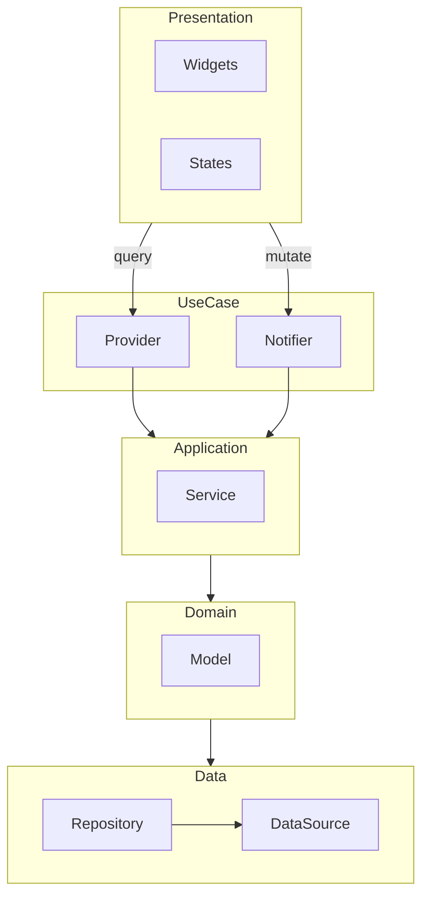

#  flutter_app_template

A template for flutter app development with best practices and features.


##  Getting Started

### Clone the repository

```bash
git clone https://github.com/firebase/flutterfire.git
```

### Install dependencies

```bash
flutter pub get
```

### Setup Flavors

By editing the `dart_defines/dev.json` and `dart_defines/prod.json` files, you can define the environment variables for the app.

```json
{
  "flavor": "dev",
  "appName": "tomoyanakano - dev",
  "appIdSuffix": "dev",
  "iOSBundleIdentifier": "com.tomoyanakano.dev",
  "androidBundleIdentifier": "com.tomoyanakano.dev",
  "LaunchStoryboardName": "LaunchScreenDev"
}
```

>[!Warning]
> `dart-define-from-file` is not supported above 3.17.0
> For more details, see the [issue](https://github.com/flutter/flutter/issues/138793).

### Generate App Icon

Using [flutter_launcher_icons package](https://pub.dev/packages/flutter_launcher_icons), you can generate app icons for both iOS and Android.

By editing the `flutter_launcher_icons-dev.yaml` and `flutter_launcher_icons-prod.yaml` files, you can define the app icon settings.
For more details, see the [documentation](https://pub.dev/packages/flutter_launcher_icons).

```yaml
flutter_icons:
  android: true
  ios: true
  image_path: "assets/launcher_icon/dev.png" // icon image path
```

Run the following command to generate app icons.

```bash
flutter pub run flutter_launcher_icons:main
```

### Generate App Launch Storyboard

Using [flutter_native_splash package](https://pub.dev/packages/flutter_native_splash), you can generate launch storyboard for iOS.

By editing the `flutter_native_splash-dev.yaml` and `flutter_native_splash-prod.yaml` files, you can define the launch storyboard settings.
For more details, see the [documentation](https://pub.dev/packages/flutter_native_splash).

```yaml
flutter_native_splash:
  color: "#ffffff"
  image: assets/launcher_icon/dev.png // launch storyboard image path

  android_12:
    image: assets/launcher_icon/dev.png // launch storyboard image path
    icon_background_color: "#ffffff" // icon background color
```

Run the following command to generate launch storyboard.

```bash
flutter pub run flutter_native_splash:create --flavors dev,prod  
```

### Integrate with Firebase 

This template uses Firebase for backend services. To integrate Firebase with the app, follow the steps below.

1. Create a new project on Firebase Console.
2. Add iOS and Android apps to the project.

#### iOS Setup

1. Download `GoogleService-Info.plist` from Firebase Console.
2. Place the file in the `ios/dev` or `ios/prod` directory. 

#### Android Setup

1. Download `google-services.json` from Firebase Console.
2. Place the file in the `android/app/src/dev` or `android/app/src/prod` directory.

### Build and Run the app

```bash
flutter run --dart-define-from-file=dart_defines/dev.json // Develpment environment
flutter run --dart-define-from-file=dart_defines/prod.json // Prod environment
```

##  Architecture

### Code Structure

This template follows the Clean Architecture pattern for organizing the codebase by using Riverpod.



### Folder Structure

This Template follows Feature First Structure(Folders-by-Feature) for organizing the codebase.
For example, the `lib` directory is structured as follows:

```bash
lib
├── src 
│   ├── features 
│   │   ├── feature1 
│   │   │   ├── data
│   │   │   ├── domain
│   │   │   ├── presentation
│   │   │   ├── providers 
│   │   │   feature2 
│   │   │   ├── data
│   │   │   ├── domain
│   │   │   ├── presentation
│   │   │   ├── providers
│   ├── common_widgets 
│   ├── constants
│   ├── extensions
│   ├── router
│   ├── utilities 
```

Refer to the [Flutter Project Structure / Code with Andrea](https://codewithandrea.com/articles/flutter-project-structure/).

##  Built in Features

- Authentication
- Maintenance Mode
- Force Update
- Notification
- Settings

##  Contributing

Feel free to contribute to this project. Any contributions you make are **greatly appreciated**.

##  License

This project is licensed under the MIT License - see the [LICENSE](LICENSE) file for details.

